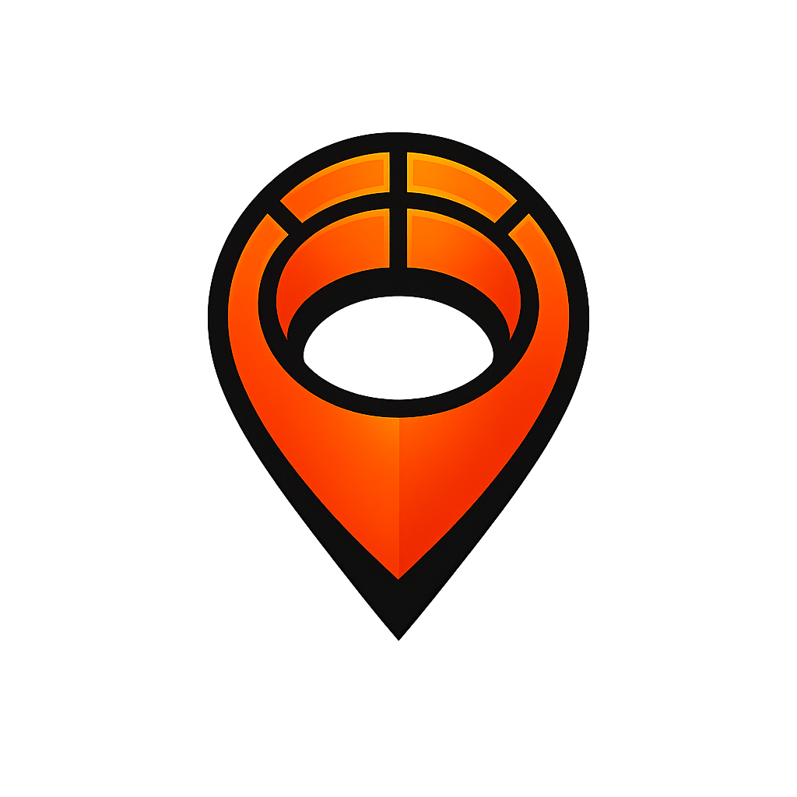
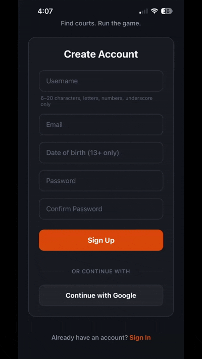
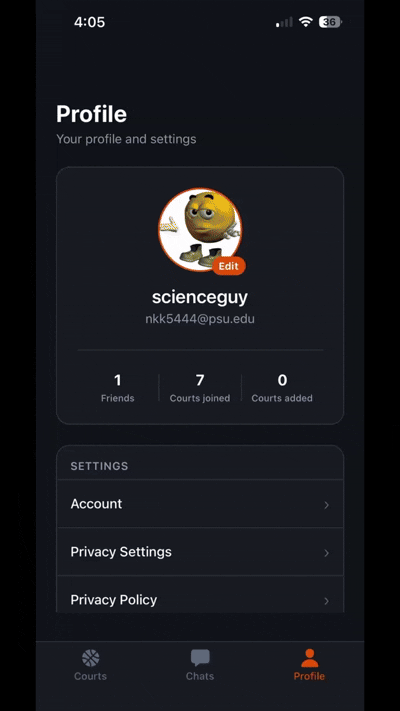

# RimRun

<p align="center">
  
</p>

<p align="center">
  <strong>Find courts. Run the rim.</strong>
</p>

<p align="center">
  RimRun is a mobile app for finding pickup basketball courts, discovering local communities, and coordinating games through direct messages and court chats.
</p>

<p align="center">
  <a href="https://nvafeomo.github.io/RimRun/">Website</a> ·
  <a href="https://nvafeomo.github.io/RimRun/#demos">Demo</a> ·
  <a href="docs/ios-testing.html">TestFlight (beta)</a> ·
  <a href="docs/android-testing.html">Play (beta)</a>
</p>

<p align="center">
  
  
  
  
</p>

---

**Live App:** [App Store](https://nvafeomo.github.io/RimRun/) · [Google Play](https://nvafeomo.github.io/RimRun/) *(public listings in progress — beta via TestFlight / Play Internal Testing)*  
**Website:** [RimRun landing page](https://nvafeomo.github.io/RimRun/)  
**Demo:** [Demo videos](https://nvafeomo.github.io/RimRun/#demos) · [Full demo page](docs/Demo/Screenshots/demo.html)

---

## Why I built it

I built RimRun because I regularly play basketball and wanted an easier way to find courts and connect with other players. The project also gave me an opportunity to practice shipping a full mobile product to real devices while working with authentication, maps, real-time communication, and a production-style Postgres backend.

## What it does

- **Courts** — Browse and search courts on a map, save courts, subscribe to updates, and add new locations.
- **Profile** — Username, optional photo, privacy toggles, and account settings.
- **Social** — Friends, direct messages, group chats, and court-specific threads for coordinating games.
- **Auth** — Email/password, Google, and Apple sign-in, plus password reset through deep links.

## Technical Highlights

| Area | What I built |
|------|----------------|
| **Authentication** | Email/password plus Google and Apple OAuth via Supabase Auth |
| **Database** | PostgreSQL with Row Level Security policies for access control |
| **Social** | Direct messaging, court-specific threads, friends, and group chats |
| **Age-aware access** | Age-based rules enforced at both the database and application layers |
| **Mobile** | Expo, React Native, TypeScript, and Expo Router |
| **Deep linking** | Password resets and auth flows use native `rimrun://` deep links |
| **Storage** | Supabase Storage for user-uploaded profile images |
| **Maps** | `react-native-maps` for discovery and court location UX |

Age-based behavior (for example, address-only vs location flows for minors) is implemented in SQL/RLS and mirrored in the client (`lib/agePolicy.ts`) so social features stay consistent end to end.

## Demo

**Courts, search, and chat**


**Auth (sign-in / account)**



**Profile**



## Stack

**Expo 54 · React 19 · TypeScript · Expo Router · Supabase (Auth, Postgres, Storage) · react-native-maps · NativeWind (Tailwind) · Google / Apple sign-in**

## Quick start

You need Node.js (LTS), npm, and a [Supabase](https://supabase.com) project. The fastest way to try the app locally is [Expo Go](https://expo.dev/go).

```bash
npm install --legacy-peer-deps
```

Create a `.env` in the project root (never commit real keys):

```env
EXPO_PUBLIC_SUPABASE_URL=https://your-project.supabase.co
EXPO_PUBLIC_SUPABASE_ANON_KEY=your-anon-key
EXPO_PUBLIC_GOOGLE_MAPS_ANDROID_API_KEY=your-google-maps-android-api-key
EXPO_PUBLIC_GOOGLE_WEB_CLIENT_ID=your-web-client-id.apps.googleusercontent.com
EXPO_PUBLIC_GOOGLE_IOS_CLIENT_ID=your-ios-client-id.apps.googleusercontent.com
EXPO_PUBLIC_GOOGLE_IOS_URL_SCHEME=com.googleusercontent.apps.your-ios-client-id
```

```bash
npm start
```

Press `a` / `i` / `w` for Android, iOS, or web, or scan the QR code in Expo Go.

For Metro networking tips, firewall notes, native builds, and backend/RLS details, see **[docs/DEVELOPMENT.md](docs/DEVELOPMENT.md)**.

**Beta testing (TestFlight / Play):** [docs/TESTING.md](docs/TESTING.md)  
**Landing page setup:** [docs/LANDING_SETUP.md](docs/LANDING_SETUP.md)

## Author

**Nvafeomo K. Konneh**

- **Email:** [rimrun.support@gmail.com](mailto:rimrun.support@gmail.com)
- **LinkedIn:** [Nvafeomo Konneh](https://www.linkedin.com/in/nvafeomo-konneh-a6a1a9367)

## License

Proprietary. [All rights reserved](LICENSE). Not licensed for copying or redistribution without written permission.
